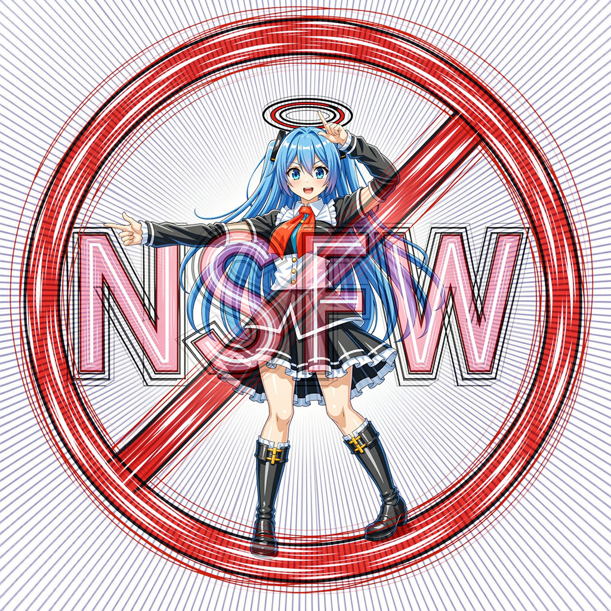

# nsfw-shorier_comfyui

（→ [English Description](https://github-com.translate.goog/phyblas/nsfw-shorier_comfyui/blob/master/README.md?_x_tr_sl=zh-CN&_x_tr_tl=en&_x_tr_hl=zh-CN&_x_tr_pto=wapp)）
（→ [日本語解説](README_日本語.md)）
（→ [อ่านภาษาไทย](README_ภาษาไทย.md)）

这个扩展包用于在 ComfyUI 中处理包含 NSFW（Not Safe For Work，不适宜在工作场所观看）内容的图片。其名称来源于日语中的"処理"（shori，意为"处理"）。

## 安装

将此仓库放置在 ComfyUI 的 `ComfyUI/custom_nodes/` 文件夹中即可使用。也可以通过 [ComfyUI Manager](https://github.com/ltdrdata/ComfyUI-Manager) 进行安装。

## 支持的模型

可以选择用于识别 NSFW 内容的检测模型：
- [compvis](https://huggingface.co/CompVis/stable-diffusion-safety-checker)
- [falconsai](https://huggingface.co/Falconsai/nsfw_image_detection)
- [adamcodd](https://huggingface.co/AdamCodd/vit-base-nsfw-detector)
- [umairrkhn](https://huggingface.co/umairrkhn/fine-tuned-nsfw-classification)
- [marqo](https://huggingface.co/Marqo/nsfw-image-detection-384)
- [gantman](https://github.com/GantMan/nsfw_model)
- [nudenet](https://github.com/notAI-tech/NudeNet)

compvis 是默认模型，根据实际测试，它能提供最准确的检测结果。也可以尝试其他模型，选择自己认为效果最好的一个。

首次使用时，系统会自动下载模型文件，请耐心等待下载完成。后续使用时会直接加载已下载的模型，无需重复下载。

## 节点

此扩展包提供 9 个功能节点。

### - GetNsfwScore

基础检测节点，输出 NSFW 内容的可能性分数。分数范围为 0 到 1，分数越高，包含 NSFW 内容的可能性越大。

不同模型的判定标准可能存在差异，输出的分数也会有所不同。

### - IsNsfw

通过设定 `threshold`（阈值）来判断图片是否为 NSFW 内容。阈值越低，越容易被判定为 NSFW。

### - ReplaceIfNsfw

使用自己准备的图片替换被识别为 NSFW 的图片。若将 `resize` 设置为 `true`，替换图片会调整尺寸以匹配原图。

### - FilterNsfw

对 NSFW 图片进行处理，支持多种处理模式，包括模糊化、马赛克处理，或替换为全黑、全白等效果。

### - FilterNsfwWithText

功能与 `FilterNsfw` 相同，但额外支持添加文本。该方法基于 [ComfyUI-TextOverlay](https://github.com/munkyfoot/ComfyUI-TextOverlay/tree/main) 扩展包。可以使用自己电脑中的字体，也可以使用自定义字体文件，例如 [字魂手刻宋.ttf](https://izihun.com/shangyongziti/618.html) 或 [meiryoub.ttc](https://github.com/yidas/fonts/blob/master/Meiryo/MEIRYOB.TTC)。将字体文件放在本仓库的 `font` 文件夹中即可使用。如果已经安装了 ComfyUI-TextOverlay 包，也可以使用该包 `fonts` 文件夹中的字体文件。

### - SaveImageSfw

功能类似于原生 `SaveImage` 节点，用于保存图片，但会自动将 NSFW 内容转换为黑色。支持保存为 `jpg` 或 `webp` 格式。此节点改编自 [comfyui-saveimage-plus](https://github.com/Goktug/comfyui-saveimage-plus/)。

### - FindNudenetPart, FindNsfwPart

使用 nudenet 模型识别图片中的特定元素。`FindNudenetPart` 会检测所有元素，`FindNsfwPart` 则专门识别通常被视为 NSFW 的内容。也支持阈值设定。

此节点改编自 [ComfyUI-utils-nodes](https://github.com/zhangp365/ComfyUI-utils-nodes)。

nudenet 模型提供 320px 和 640px 两种版本。640px 版本能检测更细小的元素，但模型文件更大，计算时间更长。

这两种 nudenet 模型也可用于 `GetNsfwScore` 及其他节点，但其输出的分数仅代表检测到的最高分元素，且不提供元素位置信息。

### - CensorNsfwPart

与 `FindNsfwPart` 类似，先识别出 NSFW 部分，然后对这些区域进行特定处理。支持的处理方式与 `FilterNsfw` 相同，但仅应用于识别出的特定区域。

