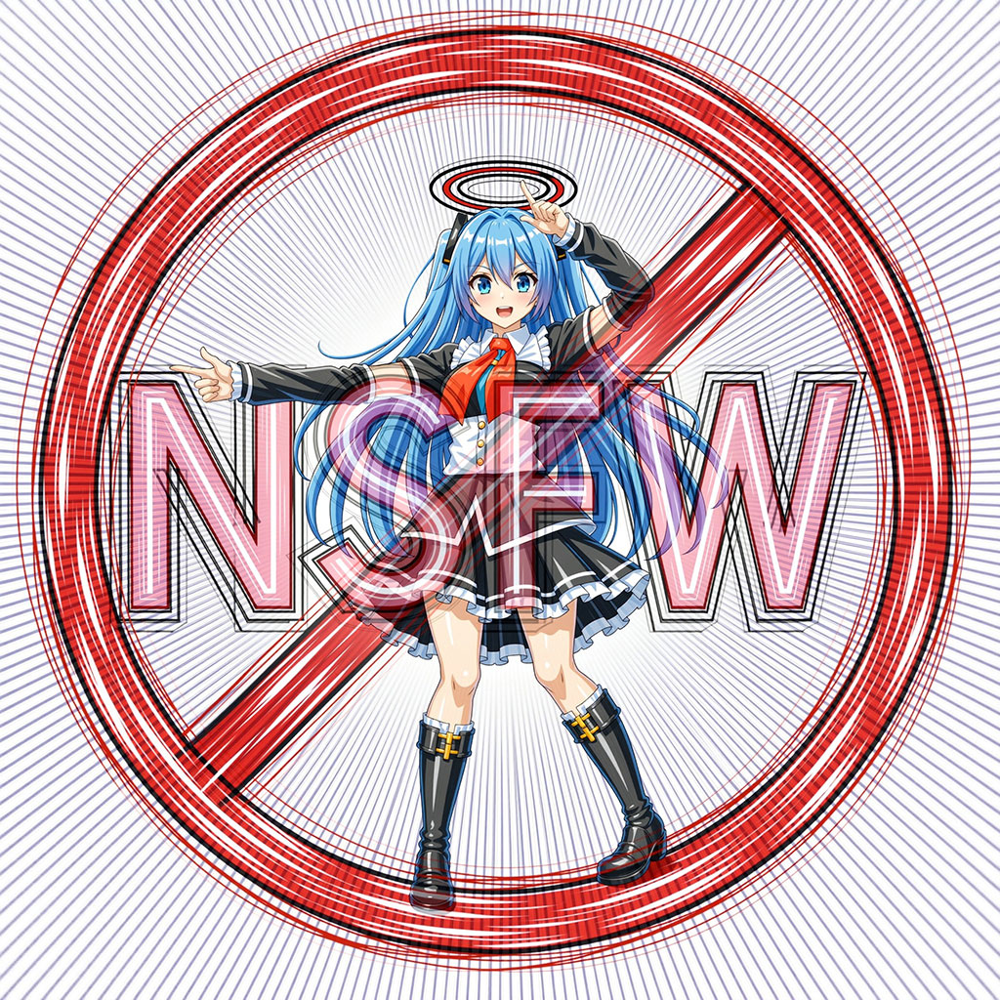

# nsfw-shorier_comfyui

この拡張パッケージは、ComfyUIでNSFW（Not Safe For Work、職場閲覧注意）コンテンツを含む画像を処理するために使用されます。名前は日本語の「処理」（shori）に由来しています。

## インストール

このリポジトリをComfyUIの`ComfyUI/custom_nodes/`フォルダに配置してください。[ComfyUI Manager](https://github.com/ltdrdata/ComfyUI-Manager)からもインストール可能です。

## 対応モデル

NSFWコンテンツを検出するために以下のモデルから選択できます：
- [compvis](https://huggingface.co/CompVis/stable-diffusion-safety-checker)
- [falconsai](https://huggingface.co/Falconsai/nsfw_image_detection)
- [adamcodd](https://huggingface.co/AdamCodd/vit-base-nsfw-detector)
- [umairrkhn](https://huggingface.co/umairrkhn/fine-tuned-nsfw-classification)
- [nudenet](https://github.com/notAI-tech/NudeNet)

compvisはデフォルトモデルで、実際のテストでは最も正確な検出結果を提供します。他のモデルも試して、ニーズに最適なバージョンを選択してください。

初回使用時にはモデルファイルが自動的にダウンロードされますので、完了までお待ちください。次回以降はダウンロード済みのモデルが直接読み込まれます。

## 機能ノード

この拡張パッケージは9つの機能ノードを提供します。

### - GetNsfwScore

基本検出ノードで、NSFWコンテンツの可能性を示すスコアを出力します。スコア範囲は0～1で、高いほどNSFWである可能性が高いということになります。

モデルによって判定基準が異なり、出力されるスコアも大きく異なる場合があります。

### - IsNsfw

`threshold`（閾値）を設定して画像がNSFWかどうかを判定します。閾値が低いほどNSFWと判定されやすくなります。

### - ReplaceIfNsfw

NSFWと判定された部分をカスタム画像で置き換えます。`resize`を`true`に設定すると、置換画像のサイズが元画像に合わせて調整されます。

### - FilterNsfw

NSFW画像に対して処理を行います。ぼかし、モザイク処理、全面黒・白への置き換えなど、処理モードを選択できます。

### - FilterNsfwWithText

`FilterNsfw`と同じ機能に加え、テキストの追加をサポートします。この方法は[ComfyUI-TextOverlay](https://github.com/munkyfoot/ComfyUI-TextOverlay/tree/main)パッケージに基づいています。PC内のフォントやカスタムフォントファイル（例：[字魂手刻宋.ttf](https://izihun.com/shangyongziti/618.html)や[meiryoub.ttc](https://github.com/yidas/fonts/blob/master/Meiryo/MEIRYOB.TTC)）を使用できます。フォントファイルは本リポジトリの`font`フォルダに配置してください。ComfyUI-TextOverlayパッケージを既にインストールしている場合は、その`fonts`フォルダ内のフォントファイルも使用できます。

### - SaveImageSfw

元の`SaveImage`ノードと同様に画像を保存しますが、NSFWと判定された場合は黒く変換されます。さらに、画像を`jpg`または`webp`形式で保存するかを選択できます。このノードは[comfyui-saveimage-plus](https://github.com/Goktug/comfyui-saveimage-plus/)を基に編集されています。

### - FindNudenetPart, FindNsfwPart

nudenetモデルを使用して画像内の特定要素を識別します。`FindNudenetPart`はすべての要素を検出し、`FindNsfwPart`は通常NSFWと見なされるコンテンツのみ識別します。閾値設定もできます。

このノードは[ComfyUI-utils-nodes](https://github.com/zhangp365/ComfyUI-utils-nodes)を基に編集されています。

nudenetモデルは320pxと640pxの2バージョンを提供しています。640pxバージョンはより細かい要素を検出できますが、モデルファイルが大きく、計算時間が長くなります。

これらのnudenetモデルは`GetNsfwScore`や他のノードでも使用できますが、その場合出力されるスコアは検出された最高スコアの要素のみを表し、要素の位置情報は提供しません。

### - CensorNsfwPart

`FindNsfwPart`と同様にNSFW部分を識別し、これらの領域に対して特定の処理を行います。使用できる処理方法は`FilterNsfw`と同じですが、識別された特定領域にのみ適用されます。

